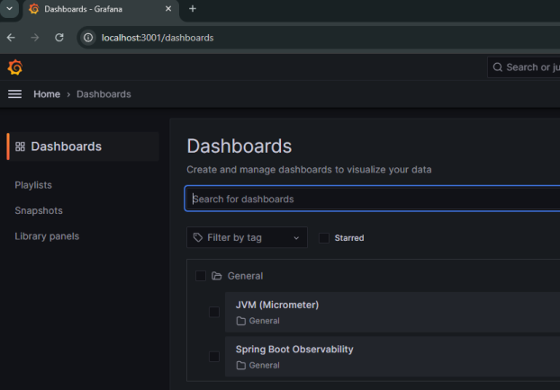
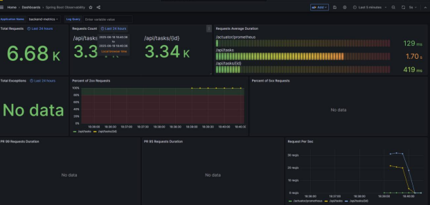
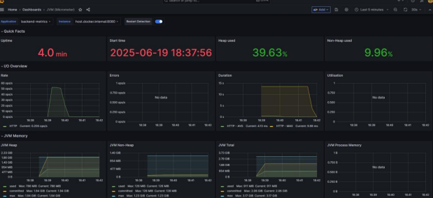
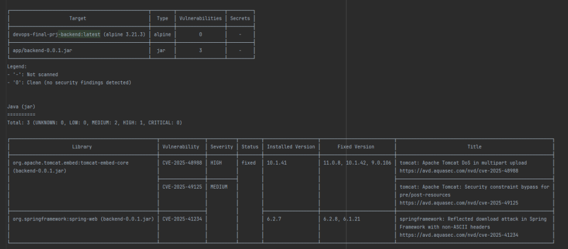

# DevOps Final Project

A complete DevOps pipeline for a multi‐service TODO application, with IaC,
configuration management, containerization, CI/CD, monitoring, alerting,
security scanning, and stress testing.

---

# First Read:

# Complete Report: [DevOps Final Project Report - Giorgi Gagnidze.pdf](DevOps%20Final%20Project%20Report%20-%20Giorgi%20Gagnidze.pdf)

# Post Mortem Report: [Post Mortem.pdf](Post%20Mortem.pdf)

---

## Setup Instructions

1. **Clone the Repository**
    ```bash
    git clone https://github.com/giorgigagnidze16/devops-final-project
    cd devops-final-project
    ```

2. **Set Up Environment Variables**
    - Create `.env` files as needed for backend, frontend, and infrastructure with required secrets.

3. **Build the Backend**
    ```bash
    cd backend
    ./gradlew bootJar
    cd ..
    ```

4. **Build the Frontend**
    ```bash
    cd frontend
    npm install
    npm run build
    cd ..
    ```

5. **Build and Start All Services with Docker Compose**
    ```bash
    docker compose build
    docker compose up
    ```

6. **(Optional) Cloud Deployment**
    - Use terraform (`infra/terraform/`) to provision your cloud VM.
    - Use Ansible (`infra/ansible/`) to set up Docker, deploy environment files, and upload application files to the VM,
      format secrets accordingly.
    - Use GitHub Actions workflows for CI/CD automated deployment.

---

## Overview of Services

- **Backend:**  
  Spring Boot REST API with an H2 in-memory database, exposing endpoints for CRUD operations on TODO tasks. Health
  endpoints and metrics exposed for monitoring.

- **Frontend:**  
  ReactJS App running on port 3000, served by NGINX. Allows users to manage TODO tasks visually.

- **NGINX:**  
  Serves the frontend to port 80 and acts as a reverse proxy.

- **Monitoring:**  
  Prometheus scrapes backend metrics. Grafana displays dashboards. ELK stack (Elasticsearch, Logstash, Kibana)
  aggregates and visualizes logs.

- **Alerting:**  
  Alertmanager sends notification emails when service outages or issues are detected.

- **Performance Loading:**  
  Gatling can be run in order to stress-test and simulate highly concurrent load environment.
- 
- **ELK:**  
  ELK stack is utilized to monitor and analyze logs.

---

## How Monitoring and Security Were Implemented

### Monitoring

- **Prometheus:**  
  Collects real-time application and JVM metrics from the backend (via `/actuator/prometheus`).
- **Grafana:**  
  Pre-built dashboards visualize metrics like CPU/RAM usage, response times, and request counts.
- **ELK Stack:**  
  Logstash collects application logs and sends them to Elasticsearch; Kibana provides log visualization and querying.

- **Alertmanager:**  
  Sends email alerts on service failures or critical metric thresholds (e.g., backend down for 30+ seconds).

### Security

- **Image Vulnerability Scanning:**  
  All Docker images are scanned with Trivy. A shell script automates scanning for all service images and writes output
  to text file.
- **Secrets Management:**  
  Sensitive credentials are never hardcoded. Instead, they are passed through `.env` files, GitHub Actions secrets, and
  Ansible for secure remote deployment.
- ****Access Control:**  
  The application uses strong file/folder permissions on the server. Only required ports are exposed.**

---

## Screenshots

### Monitoring Dashboards

#### Grafana






### Security Scan Results

#### Trivy Scan



---

Author: Giorgi Gagnidze

